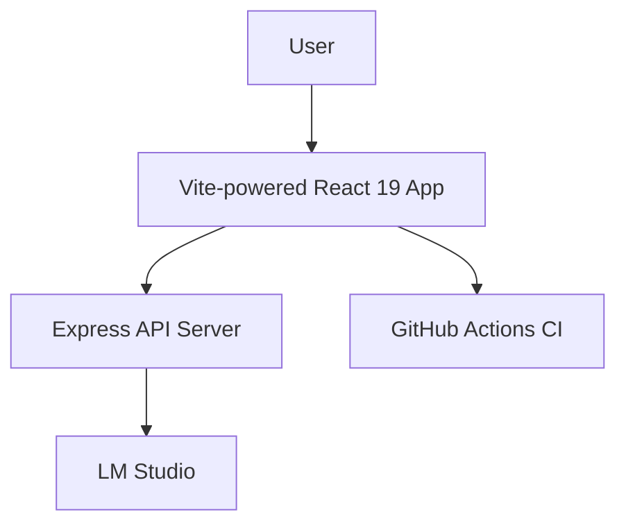

# Absurd

[](https://github.com/ezpzzz/absurd/actions/workflows/ci.yml) 

A React 19 + TypeScript application with routing, theme management, and prompt-based site generation features. Built with Vite, Material-UI, and comprehensive testing.

## Quick Start

```sh
pnpm install
pnpm dev
```

LM Studio should be running locally so the server can generate content.


## Features

- ⚡ **React 19** with TypeScript for modern development
- 🎨 **Material-UI** with dark/light theme toggle and persistence 
- 🧭 **React Router** for navigation and URL management
- 💾 **localStorage Integration** with error handling and custom hooks
  - 🧪 **Comprehensive Testing** with Jest, Testing Library, and Playwright
- 🔧 **Development Tools** - ESLint, Prettier, Husky pre-commit hooks
- 🚀 **CI/CD Pipeline** with GitHub Actions

## Architecture



See [docs/architecture.md](docs/architecture.md) for more details.


## Getting Started

### Prerequisites

- Node.js 20+
- pnpm

### Installation

```sh
pnpm install
```

### Development

```sh
# Start development server
pnpm dev

# Run tests
pnpm test

# Run linting
pnpm lint

# Build for production
pnpm build
```

## Available Scripts

- `pnpm dev` - Start Vite development server with HMR
- `pnpm build` - Type-check and build optimized production bundle
- `pnpm lint` - Run ESLint with TypeScript support
  - `pnpm test` - Run Jest unit tests with coverage
  - `pnpm test:e2e` - Run Playwright end-to-end tests

## Project Structure

### Frontend
- **Framework**: React 19 with TypeScript
- **Build Tool**: Vite for fast development and optimized builds
- **UI Library**: Material-UI v6 with Emotion styling
- **Routing**: React Router v7 for client-side navigation
  - **Testing**: Jest + Testing Library for units and Playwright for e2e

### Backend  
- **Runtime**: Node.js with TypeScript
- **Framework**: Express.js with CORS support
  - **Testing**: Jest + Supertest for API testing

### Development Workflow
- **Code Quality**: ESLint + Prettier with consistent formatting
- **Git Hooks**: Husky runs lint and tests on every commit
- **CI/CD**: GitHub Actions for automated testing and building

## Testing

Unit tests use Jest with React Testing Library while Playwright covers the end-to-end flow.

```sh
# Run unit tests with coverage
pnpm test

# Run e2e tests
pnpm test:e2e

# Generate coverage badge
pnpm coverage:badge
```

## Deployment

The application is configured for deployment with:

- Production-optimized Vite build
- Type checking during build process  
- Automated CI/CD pipeline via GitHub Actions
- Static asset optimization and bundling

## FAQ

**Why React 19\?**  
React 19 enables modern features like Server Components and improved Suspense.

**Do I need LM Studio running\?**  
Yes, run LM Studio in server mode locally before using `pnpm dev`.

**How do I report a bug\?**  
Use the provided issue template under .github.

## Contributing

See [CONTRIBUTING.md](CONTRIBUTING.md) for contribution guidelines and coding standards.

## License

This project is licensed under the MIT License.
